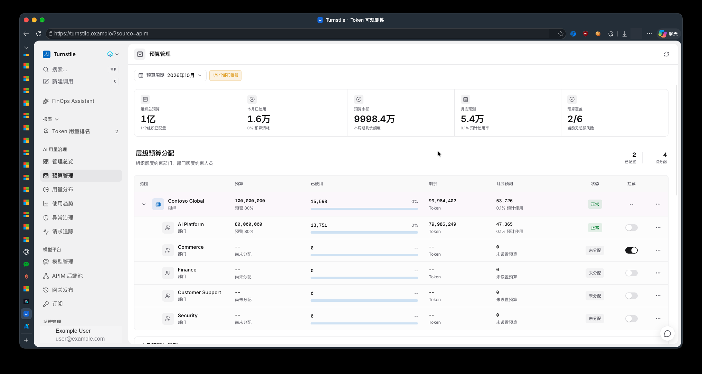
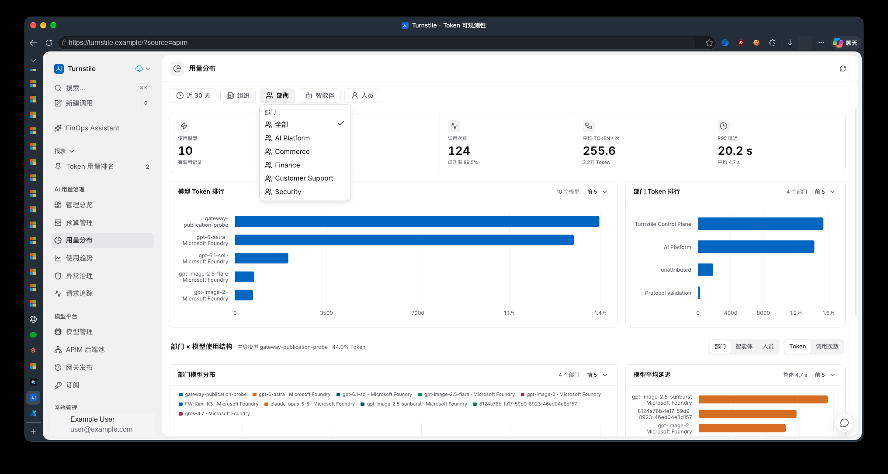

# 组织管理功能需求分析

| 项目 | 内容 |
| --- | --- |
| 功能目录 | `plan/organization-management/` |
| 分析日期 | 2026-10-10 |
| 源码基线 | `12dc1ee`，分支 `codex/org-people-management` |
| 状态 | P1已上线；P2代码已实现，真实Entra和员工身份验收待配置；未完成整体验收，见[实施记录](implementation.md) |
| 配套文档 | [设计文档](design.md) |
| 规范核查 | [项目规范核查记录](review.md)，含初始化、升级与发布边界 |
| 核查边界 | 下文现状分析保留`12dc1ee`设计基线；实际数据库/APIM发布证据见实施记录，真实Graph未配置 |

## 1. 目标

在 APIM 模式的“系统管理”下新增“组织管理”，让管理员通过页面维护企业组织、部门、团队和人员，替代生产目录依赖代码常量与用量发现的方式。GitHub Copilot 模式暂不显示该菜单，继续使用已有的独立“企业团队”功能。新目录必须兼容预算管理、用量分析、模型授权、调用归因及个人账号信息，支持部门范围授权，并为指定 Entra ID 租户的 Group 和人员同步预留可靠的数据与任务模型。

本需求最初为设计阶段文档，现已开始实施。下文“应”“拟新增”仍描述目标能力，不代表整体已实现或上线；实际结果以[实施记录](implementation.md)为准。初始化、既有数据升级、运行包与部署脚本配套改造属于正式功能交付范围，不能只交付组织 CRUD 页面。

### 1.1 菜单权限组补充需求（2026-10-10）

项目聚焦 AI 模型治理，不承担正式企业人事管理。“岗位”从人员表单和列表移除，
替换为独立的**菜单权限组**：组织管理员、部门管理员、团队管理员、普通用户。
同一人员可以同时具有多个管理员组，使用标签显示和复选框选择，不使用单选下拉框。
菜单权限取所选管理员组的并集；移除最后一个管理员组后回落普通用户。
未指派、未关联登录账号及来源同步新增人员均默认普通用户。

菜单组只控制应用页面入口，不控制 APIM。以下四层必须独立：

| 层次 | 来源 | 本次变化 |
| --- | --- | --- |
| 菜单访问 | 本地人员 `menu_permission_groups` 数组 | 新增；控制侧栏、搜索、直达链接、预取及浮动助手 |
| 平台操作 | `app_user.role` 的 Owner/Member | 不变；菜单组不能授予 Owner 写操作 |
| 部门数据范围 | `directory_department_grant` | 不变；新菜单组不新增、撤销或扩大数据授权 |
| 模型与网关 | 模型授权、APIM 身份、订阅、预算及限流 | 不变；进入菜单不等于允许调用模型 |

初始菜单矩阵如下。数据源适用性、功能开关及各 API 的既有授权仍独立生效。
组织管理在 GitHub Copilot 下继续隐藏，企业团队仍为独立页面。

| 菜单 | 普通用户 | 团队管理员 | 部门管理员 | 组织管理员 |
| --- | --- | --- | --- | --- |
| 用户设置、APIM 调用测试 | 是 | 是 | 是 | 是 |
| 用量概览、分析、趋势、请求、助手、固定报表 | 否 | 是 | 是 | 是 |
| 模型管理、APIM 组织管理 | 否 | 是 | 是 | 是 |
| 用量治理、预算、Copilot 成本中心/未分配用户 | 否 | 否 | 是 | 是 |
| 系统设置、APIM 后端池/发布/订阅、Copilot 企业团队 | 否 | 否 | 否 | 是 |

Owner 保留全部适用菜单，作为独立的平台管理员，不新增第五个可指派的菜单组。
初期采用固定组与集中菜单白名单，不提供任意自定义组或菜单编辑器；后续可独立扩展。
赋组/降组由 Owner 明确操作，不能通过 Entra Group、岗位文本、部门数据授权或团队成员关系自动获得。
仅获菜单组但未获数据授权的用户可以进入对应页面，但仍按旧 API 规则显示无权限，
不得为了让页面可用而自动授予部门能力。现有普通 Member 的业务 API 读取规则不因菜单隐藏而改变。

## 2. 当前模块如何管理与存储数据

### 2.1 核心结论

**当前组织/部门主数据不在数据库中；人员目录是代码目录与数据库事实的运行时合并。数据库已经保存预算、拦截配置、登录账号、模型策略和用量，但这些表不是组织人员主数据表。**

| 数据 | 当前来源与存储 | 管理方式 | 不具备的能力 |
| --- | --- | --- | --- |
| 组织 | `enterprise_catalog()` 代码常量 | 修改代码并发布 | 数据库组织表、组织 CRUD |
| 部门 | 同一函数的固定列表、`parent_id` 指向组织 | 修改代码并对齐网关配置 | 部门 CRUD、部门管理员 |
| 项目/智能体目录 | 同一函数的固定列表 | 修改代码；与遥测维度并存 | 通用组织树、项目归属动态维护 |
| 示例人员 | `test.user01@contoso.com` 至 `test.user20@contoso.com` | 固定生成并轮流分配五个部门 | 人员新增、编辑、调岗、停用 |
| 已观测人员 | PostgreSQL `token_usage`，取每个 `user_id` 最新 APIM 用量的部门 | 使用网关后运行时发现 | 权威任职关系、未使用网关的普通人员名单 |
| Owner 补充人员 | PostgreSQL `app_user` 中启用的 Owner | 运行时补入默认 `department-platform` | 全部登录账号自动入目录、真实部门归属管理 |
| 登录账号 | `app_user` UUID、邮箱、名称、密码哈希、`owner/member`、启用状态；`user_session` | 密码账号通过 `backend.accounts`；Microsoft 登录按邮箱 upsert | 账号与人员明确绑定、部门范围角色、持久化 Entra `tid/oid` |
| 月度 Token 预算 | `token_budget`，键为 `(period_start, scope_type, scope_id)` | 预算 API；数据库事务维护层级额度 | 新建组织/部门/人员 |
| 部门拦截 | `department_enforcement`，部门 ID 对应 `block/audit` | 预算页/API；未配置默认 `audit` | 组织关系维护；部门总额度实时强拦截不能从该开关推断 |
| 人员模型授权 | `user_model_policy`、`user_model_access` 与审计表 | 人员预算区批量管理，可独立于预算设置 | 身份合并、组织同步即自动授权 |
| 用量及预算证据 | `token_usage`、账单请求与预算证据/预留/恢复表 | APIM 遥测、补偿和对账 | 以当前目录任意改写历史计费身份 |
| 网关实时账本 | Azure Table Storage，人员/月分区及 `Q/C/M/R` 行 | 从 PostgreSQL 投影；APIM 写预留 | 主目录存储；不能替代 PostgreSQL 权威配置 |

当前固定目录包含 `org-contoso-global / Contoso Global`，以及 `department-platform`、`department-commerce`、`department-finance`、`department-support`、`department-security` 五个部门。

### 2.2 目录与预算查询链路

```text
enterprise_catalog()：组织、部门、项目、智能体、示例人员
  + repository.observed_users()：最新 APIM 遥测人员
  + repository.application_owners()：启用 Owner 账号
  -> EnterpriseEntityCatalog
  -> /api/v1/enterprise/entities：筛选、调用、规则与助手目录
  -> TokenBudgetService._entities()：预算范围校验与预算展示

token_budget + token_usage/预算证据
  -> 组织/部门/人员月度额度、消耗、预测、审计
```

- `observed_users()` 在 PostgreSQL 中按 `user_id` 取最新请求；不读 GitHub Copilot 数据域。
- `merge_observed_users()` 只补充未在目录中的邮箱形 ID，且部门必须已知；忽略机器身份、`unattributed` 和未知部门。
- 必须区别仓储与合并函数：虽然仓储选择最新遥测，**已存在的示例人员不会被合并函数改部门**；同一次合并中已观测人员先于 Owner 补充，未被发现的 Owner 才落入默认部门。运行时合并不写入任职主数据。
- 普通 `member` 登录账号不会仅因登录而进入人员目录。人员存在也不等于存在登录账号。
- 预算写入先解析目录 `scope_id`，再校验组织 -> 部门 -> 人员额度；直接插入预算记录不能让目录出现新部门。
- 概览默认不返回全部人员；部门人员接口另有搜索、状态和分页，预算人员区仍受单一部门 `parent_id` 约束。
- 数据库保存 `parent_scope_id` 并以事务锁校验父预算；当前服务层又按即时目录关系计算子额度。新增调岗必须解决这两种关系可能不一致的问题。
- 预算用量来自多类有效证据，不等于对 `token_usage` 简单求和；组织管理不能另写一套计费口径。

### 2.3 登录与 Entra/APIM 归因

- 控制台当前角色只有全局 `owner/member`。预算读取只要求有效会话，写入要求 Owner；现有用量筛选参数是查询条件，**不是部门级数据权限边界**。
- 控制台 Microsoft 登录验证签名、受众、与 `tid` 对应的签发者和允许邮箱域。验证结果含 `tenant_id`，但登录 upsert 仅保存邮箱和名称，不持久化 `oid` 或完整租户身份绑定。
- APIM 员工请求另用 Entra access token；取 `preferred_username -> upn -> email` 作为人员 ID，取首个 `department-` App Role 作为部门。控制台邮箱提取顺序不同，为 `email -> preferred_username -> upn`，可能造成同一人标识不一致。
- `employeeDepartmentMap` 提供部门显示名；`employeeOrgId/employeeOrgName` 提供组织归因；不是 Graph Group 同步。
- APIM 当前读取 `tid/oid` 用于员工限速键，但当前人员治理与遥测 `user_id` 仍是邮箱形字符串，不能宣称已有稳定对象 ID 治理。
- Bicep 默认组织为 `organization-default / Default Organization`，与代码目录默认组织不同；这只是源码配置风险，未据此判断线上配置。
- Graph Group、App Role、平台 Owner 和部门管理员是四种不同语义，不能互相自动等价。

### 2.4 截图解读



图 1 显示现有组织 -> 部门预算行、人员预算入口和部门拦截，不是目录编辑页面。预算金额和具体企业名称仅作参考；文档副本已脱敏环境地址与账号，原始附件未修改。



图 2 中部门筛选为固定目录，而排行包含 `Turnstile Control Plane`、`Protocol validation`、`unattributed` 等遥测标签。源码确认两者来源不同，因此新目录要让历史/未映射部门可查询，不能把排行中出现的名称直接认作已建部门，也不能静默丢弃其用量。

## 3. 范围与分期

| 阶段 | 必需交付 | 不在该阶段默认启用 |
| --- | --- | --- |
| P1 基础目录 | APIM 模式系统入口、组织/部门/团队、人员与任职、部门管理员、账号显式绑定、审计、统一目录服务、历史查询适配、新装初始化、兼容升级、脚本/运行包配套及网关状态提示 | GitHub Copilot 模式组织管理入口、Graph 自动同步、新预算 `team` 范围、跨组织即时调岗、直接创建密码或更改 Owner |
| P2 Entra 同步 | 指定租户连接、显式 Group 映射、人员/成员关系只读导入、预览与冲突处理、全量与增量、任务监控、稳定身份与网关投影 | 写回 Entra、Group Owner 自动变部门管理员、跨租户邮箱自动合并 |
| P3 可选扩展 | 嵌套部门、多组织成员、跨部门协作、其他目录连接器、统一稳定身份治理、独立团队预算和显式跨数据源映射 | 无需本期提前实施全部能力 |

P1 的网关约束：不能把仅在控制台保存的归属宣传为已在员工数据面生效。仍用静态 APIM App Role 配置时必须显示“目录已保存 / 网关归因待对齐”，并将相关上线校验作为生产验收条件。P2 动态身份投影启用后，才可承诺同步后的归属自动作用于网关。

## 4. 功能需求

### ORG-01：入口与工作区

- APIM 模式提供“系统管理 > 组织管理”，拟采用 `?source=apim&page=organization-management`；不是两个数据源共用的前端页面。
- 切换到 GitHub Copilot 后隐藏组织管理菜单，同时不在搜索/命令面板中列出该入口，不渲染、预取或轮询组织管理页面数据。该模式保留“企业团队”（`copilot-enterprise-teams`）及现有成本中心、未分配用户等独立功能，不将本地目录与这些功能合并。
- 从组织管理切换到 GitHub Copilot，或直接访问 `?source=github-copilot&page=organization-management` 时，按该来源现有规则归一化到“使用指标”（`finops-overview`），同步修正 URL；不得在后台继续显示 APIM 目录内容。浏览器刷新、前进/后退也执行相同校验。
- 切回 APIM 后按权限恢复组织管理入口；用户可重新进入原目录，不删除组织数据或因切换触发同步。未保存表单离开前提示确认，取消切换时留在原页面。
- Owner 可维护全部组织；菜单组决定入口，既有部门授权决定 Member 实际可访问的目录范围，两者独立。普通用户组不显示组织管理入口，个人组织信息仍在用户设置中只读展示。
- 左侧组织/部门/团队树，右侧当前节点详情及“人员 / 管理员 / 变更记录”；Owner 增加“目录同步”页签。
- 延续截图的紧凑标题、工具条、平面表格和状态样式。桌面不堆叠装饰卡片；移动端组织选择与人员列表分步显示。
- 新增、保存等明确命令用图标加文本；行操作用图标菜单和 tooltip。具备搜索、分页、空态、无权限、加载、保存失败及冲突状态。
- 复用已有组件及中文/英文/日文/韩文翻译体系；键盘可操作，长名称与邮箱不得遮挡操作列。

### ORG-02：企业组织

- 创建/编辑名称、唯一业务编码、描述、联系信息、启用状态；系统 ID 创建后不可修改、不由名称生成。
- 可配置指定 Entra 租户连接，但组织不是租户本身：同一企业可能接入多个租户，同一租户的不同 Group 可映射到不同企业；映射均需显式确认。
- 新组织不会自动获得预算、模型访问、网关订阅或全局管理权限。
- 默认仅允许归档/停用，不级联硬删除。存在人员、预算、应用、项目或待执行同步任务时先展示依赖并阻止不安全操作。
- 保留历史可读记录及 ID；恢复不自动重新启用已单独停用的账号、模型或网关访问。

### ORG-03：部门与团队

- P1 支持组织下部门、部门下团队；部门和团队名称、编码、描述、状态可维护。
- 同组织业务编码唯一；禁止循环、跨组织父节点及团队作为部门预算父节点。
- 部门是现有预算锚点；团队为协作和成员管理单位。组织 -> 部门 -> 人员预算层级不改变。
- 人员可直接加入部门，也可加入该部门下一个或多个团队；团队成员不重复占用预算人数或重复汇总 Token。
- 部门改名不改 ID；有引用的部门不能删除或悄悄迁到其他组织。团队迁移若改变计费部门，必须走人员/归属变更流程。
- 部门停用不等于将拦截切为 `audit`；展示网关实际状态和未完成投影，禁止用删除治理配置解除限制。

### ORG-04：人员与账号

- 在部门/团队中新增人员，填写显示名、邮箱/UPN、可选人员编号、菜单权限组、状态及主部门；支持编辑资料、团队成员关系和检索。历史岗位数据只为兼容保留，不用于菜单或网关授权。
- 明确展示“人员状态”“登录账号状态”“目录来源”“网关映射状态”；不能用一个启用开关混淆四种状态。
- 人员与 `app_user` 显式绑定；新增人员默认不创建登录账号或密码、不发 Owner、不绕过登录允许域/租户规则。
- 本模块编辑的是人员业务资料，不提供密码重置、Microsoft 头像修改或平台角色变更；这些仍属于现有账号/自助设置边界。
- P1 手工人员需要可验证的邮箱形治理标识；同名不合并。无法映射人员治理身份的外部人员保留待关联，不允许伪造邮箱分配预算。
- 名称可编辑，治理 ID 不变；邮箱更新为联系资料/待验证别名，不能直接修改预算、账本、遥测或登录账号标识。
- 同邮箱跨租户、多人共享邮箱、身份碰撞进入冲突队列；已存在登录账号不得仅凭 Graph `mail` 相同自动绑定。
- 新增手工人员可在尚未调用网关时分配预算；未归属人员不允许分配部门下预算。
- 调岗需要影响预览：当前/未来预算、模型策略、管理员授权、应用/项目引用、网关归因。默认下月生效，同月特殊转移由 Owner 单独审批。
- P1 不支持同月跨组织转移；历史任职和调用归属不被改写。团队变更不改变唯一主计费部门。
- 停用人员保留历史用量、审计、已配置预算和模型策略；必须投影显式禁用状态，不能删除模型策略后触发旧版“未配置允许”。

### ORG-05：部门管理员

- 由 Owner 设置一个或多个部门管理员，必须绑定有效 `app_user`，且具备该部门有效任职；撤销/失效及时生效。
- 部门管理员仍是平台 Member，授权单独按部门保存；不能创建组织、修改全局设置、任命管理员、改变平台角色或管理同步凭据。
- 可维护本部门团队、人员业务资料及团队成员；跨部门移动、改变主计费部门、编辑外部权威字段须 Owner 或对应审批。
- P1 默认不授予预算/模型写权限；后续可显式授予 `budget.allocate_users` 或 `model.assign_users`，额度上限仍由 Owner 设置。
- 禁止自我提权、修改其他部门、用团队成员关系扩张预算权限。预算按周期归属校验，不能因人员今日调入就修改其过去部门预算。

### ORG-06：数据查询与权限兼容

- 统一目录读取，预算、账号、调用、规则与助手不再各自拼接目录。
- 保留既有组织/部门/人员治理 ID、API 的三层预算范围和老书签；新增管理 API 与旧查询 API分离。
- 管理列表显示当前有效目录；历史报表筛选另提供查询时间内出现过的归档/未知维度，显示来源和原始 ID。
- 历史用量保持“请求发生时归属”；预算父级保持“预算周期分配归属”；当前任职显示在组织管理。三者差异必须明确展示。
- 当前组织改名后，排行不得因 `ID + 旧名/新名` 分组形成重复实体；按稳定 ID 聚合，详情仍保留请求原始名称。
- 新增部门权限需要服务端约束目录、聚合、分页总数、详情、导出、助手工具、固定报表与审计，不能只在前端删选项。
- 普通 Member 现有全域只读行为不在本期暗中改变；部门管理员采用受限模式，除非账号本身为 Owner。两者叠加规则需显式测试。
- 没有权限范围时必须“拒绝/空结果”，不能转为空过滤条件后查询全量；当前仓储把空 tuple 解释为无约束，不能直接复用该行为作为权限实现。
- GitHub Copilot 企业、团队、成本中心和账号映射维持独立数据域；该模式隐藏本模块菜单，继续使用独立“企业团队”页面。本地团队不自动成为 GitHub Team，Entra 同步不触发 GitHub 权限或计费操作。
- 部门管理员不因本地授权获得外部企业全域治理数据；没有可靠部门映射的跨数据源操作应明确拒绝，而非假装已实现范围过滤。
- 数据源切换只控制前端入口和页面适用范围，不替代服务端角色/部门权限，也不关闭已批准的后台目录同步任务；不能靠修改 `source` 参数取得权限。

### ORG-07：Entra ID 扩展

- Owner 选择目标租户、云环境、后台应用身份和 Group 范围；不沿用当前头像 `User.Read` token 做全目录同步。
- Group 与部门/团队显式映射；Group 是成员集合，不自动构成组织树，Group Owner 不自动授予部门管理员。
- 人员外部键采用云环境 + `tenant_id + object_id`；UPN、mail、显示名可变，不能作为跨租户唯一键。
- 支持全租户人员目录或仅选定 Group 人员两种范围；默认选定 Group，最小化人员资料和访问范围。
- 默认只导入用户直接成员；嵌套组展开为明确选项，设备/服务主体不转换成人员；Guest、无邮箱、隐藏成员均要有确定处理结果。
- 多 Group 命中多个部门时标记冲突，保留旧主部门，不按列表顺序随机选取；团队关系可多选，预算仍唯一主部门。
- 外部权威资料只读，本地覆盖/员工业务资料分列保存。同步不得覆盖本地管理员授权、预算、模型授权、密码及人工停用。
- 全量完成才可认定人员缺失；分页失败、403、429、超时或权限减少不得触发批量删除/停用。
- 提供预览、确认、计划执行、失败重试、差异报告与删除保护。停用或移出同步范围默认进入待处理，不物理删除、不直接调岗。
- 增量游标按连接/资源/规则版本隔离；失效后安全重建全量，不能清空目录。定期完整校验处理最终一致性和成员展开变化。

### ORG-08：审计与运营

- 每次主数据、绑定、任职、授权、同步映射及停用变更记录操作者、来源、前后值、原因、时间、任务/请求 ID。
- 乐观版本控制；并发更改返回冲突并保留用户输入。批量写入提供明确成功/失败结果，不能返回已保存而实际部分丢失。
- 保存与网关投影分开显示；凭据、Graph token、密码哈希不进入响应、日志或审计前后值。
- 正式环境缺少目录迁移时失败并报告，不能静默回到示例目录。

### ORG-09：全新安装与应用初始化

- 遵循 `README.md` 与 `docs/testing.md` 的空业务库约束：迁移只建立 schema、约束及平台控制元数据，不自动建立 Contoso 企业、五个示例部门、测试人员、客户模型或预算。
- 保持现有 `backend.migrate -> backend.bootstrap -> backend.api` 启动入口；首个 Owner 仍只在账号表为空时创建，重启/重跑不得重置密码、名称、头像、会话或已有账号。
- 新装目录可为空，Owner 登录后通过页面建立真实组织/部门，再显式建立自己的人员记录和账号绑定。没有部门时提示完成组织设置，不把 Owner 自动塞进 AI Platform，也不静默为它分配模型。
- 初始化区分“新装空目录就绪”和“既有数据回填待切换”；不能把新建目录表为空当作新装判断。全新初始化必须由部署配置显式授权，并校验不存在旧预算、用量、模型人员授权、应用归属等业务引用。
- 开启数据库目录后，缺 schema、错误版本或升级未完成必须阻止目录依赖功能就绪；不要求 Graph 可用才能启动 P1，不把目录尚空误判为数据库故障。
- 目录初始化不得依赖前端示例、调用付费模型、自动创建 Entra 应用或扩大 Azure/GitHub 权限。显式 demo 与生产初始化分离。

### ORG-10：迁移升级与部署脚本

- 新装和升级使用同一条新增编号 `.up.sql` 链，经 `backend.migrate` 执行；不改任何已应用迁移、不直接手工执行重复建表 SQL、不新增自动 `.down.sql`。
- schema 迁移与业务回填分离。既有实例必须先备份/核查，再预览回填，处理冲突并批准，幂等应用，验证查询与额度，最后切换目录权威源；API 启动时不得自动扫描全部用量完成回填。
- 回填保留原 scope/person ID、预算周期父级和既有模型策略，不重写历史 APIM 计费身份，不编造历史任职。未确认归属以候选/历史实体保留。
- 新运维工具应复用核心服务、迁移入口及现有私有部署状态；提供 plan/apply/verify 与中断续跑，不再造另一套部署系统或 secrets/state。
- 当前迁移 runner 没有全局执行锁；实施时必须补充数据库级串行化及并发迁移验证，覆盖多实例启动和运维预迁移重叠，不能只依赖本机锁。
- API、Telemetry 和 Control-plane 包的共享核心版本、功能开关、迁移及回填完成状态需协调。后台代码不能 import `backend`；仅更新前端或 API 不能宣称月度调岗、身份投影已交付。
- 新装 Bicep、既有环境 settings 合并、启动检查、Function 索引验证及包清单需配套适配。保持独立功能开关；现有 ledger、镜像能力和预算证据 cutoff 不随本功能启用或重置。
- 既有部署继续保留数据库、账本、APIM、identities、密码及 secret state。APIM 身份 policy 变更走版本化增量升级，不重新 bootstrap、不替换客户当前 policy。
- 回滚采用关闭新增写入/worker、回滚已验证兼容应用包并保留目录与审计；数据新增后不得回退到丢失新人员的种子目录。真实数据库恢复和安全禁用撤销需要单独审批。

### ORG-11：项目规范与交付证据

- 以根目录 README/CONTRIBUTING 及 `docs/architecture.md`、`configuration.md`、`deployment.md`、`testing.md`、`security.md` 为约束来源；规范核查覆盖源码、契约、打包和操作流程，不只核对文本。
- 保持控制面/推理面分离：APIM 不逐请求调用 FastAPI、PostgreSQL 或 Graph 获取目录；目录任务不阻塞用量消费与预留恢复。
- 既有预算、模型、发布和订阅治理写入仍为 Owner-only。部门管理员只通过新增受限目录能力维护人员/团队；预算/模型授权委派默认不启用，另行评审后才调整规范。
- 正式实施需同步维护中英文 README、docs 指南和 OpenAPI，而不是让 `plan` 成为唯一运维入口。配置实例、备份、计划、部署目标和证据放私有目录，不在公开文档记真实环境信息。
- 必须按候选版本记录新装与升级两条路径的真实 PostgreSQL、浏览器、部署包及必要 Azure 验证。单元 mock、源码字符串检查和打包成功不能代替这些结果；缺关键证据保持未验收。

## 5. 数据操作权限矩阵

本节描述已有 API/数据范围权限，不是菜单组映射。菜单可见性以第 1.1 节为准；
菜单组不能绕过本节授权规则。

| 操作 | Owner | 部门管理员 Member | 普通 Member | 同步服务身份 |
| --- | --- | --- | --- | --- |
| 组织管理入口（仅 APIM 模式） | 全域 | 授权部门 | 不显示 | 无交互入口 |
| 组织/部门创建与归档 | 允许 | 不允许 | 不允许 | 仅批准的映射计划 |
| 团队与本地人员业务资料 | 允许 | 本部门 | 不允许 | 仅同步自有字段 |
| 主部门/计费归属变更 | 审批流程 | 仅提交申请 | 不允许 | 生成待审批差异 |
| 绑定登录账号、设置管理员 | 允许 | 不允许 | 不允许 | 不自动绑定/授权 |
| 部门总预算/拦截模式 | 沿用 Owner | 不允许 | 不允许 | 不允许 |
| 人员预算/模型分配 | 沿用 Owner | 显式授权后本周期本部门 | 不允许 | 不允许 |
| 范围报表/人员详情/审计 | 全域 | 服务端限制部门范围 | 沿用现有只读；个人设置仅本人 | 仅任务需要的数据 |
| 同步连接/凭据/Group 映射 | 允许 | 不允许 | 不允许 | 使用凭据，不修改管理授权 |

新增范围角色不是 Entra 管理员角色，也不是 Graph 权限授予机制。

## 6. 验收标准

| 编号 | 可验证结果 |
| --- | --- |
| AC-01 | APIM 模式按权限显示组织管理入口；刷新、前进/后退和移动端可正常进入；无权限直达 URL/API 被拒绝 |
| AC-02 | 新组织/部门/团队和人员重启后存在，不再要求修改 `enterprise.py`；新人员不自动有账号或角色 |
| AC-03 | 对同一旧 ID，迁移前后预算、模型策略、证据与账本计费一致；不得更改历史 `token_usage.user_id` |
| AC-04 | 新人员未调用网关也可被预算 API解析；团队多重成员不重复预算人数和用量 |
| AC-05 | 已归档与未知部门历史用量可筛选，改名排行按 ID 唯一聚合；明细原始名称保留 |
| AC-06 | 调岗前后跨月预算正确；目标容量不足返回冲突且不改变任职；同月跨组织转移被明确拒绝 |
| AC-07 | 管理员篡改部门/人员/请求 ID、批量选择或助手参数均不能读写其他部门，分页 total 不泄漏全域人数 |
| AC-08 | 撤销管理员、停用账号和人员后会话/缓存/网关的生效延迟有上界；失效身份不因策略缺失获得默认允许 |
| AC-09 | 目录与静态 APIM App Role 不一致可见；目录保存不假报网关已生效，受信归因不能由客户端伪造 |
| AC-10 | Entra 同租户对象重命名仍对应同人；跨租户同邮箱不自动合并；Group Owner 不自动获得管理权限 |
| AC-11 | Graph 分页失败、403/429、delta 失效、隐藏成员不足权和批量删除阈值均不会清空正式目录 |
| AC-12 | 重跑迁移和同步幂等，原迁移校验和、既有调用身份、预算与人工授权不变；真实环境结果与单元测试分开记录 |
| AC-13 | GitHub Copilot 模式不显示组织管理菜单或搜索入口、不渲染/预取/轮询该页面；切换及直达 URL 归一化到使用指标，企业团队功能不受影响；切回 APIM 恢复入口且目录数据不变 |
| AC-14 | 全新实例业务目录为空，Owner 可真实登录并手工完成首个组织/部门/人员绑定；重复启动不注入示例、不重置已改密码/资料 |
| AC-15 | 既有实例经备份、plan/apply/verify 后切换；回填失败或版本漂移不改变权威源；升级未 ready 时不能假报已完成 |
| AC-16 | 两个迁移进程及多实例启动并发无重复 DDL/账本行，schema/回填失败可恢复；不可变旧迁移 checksum 与账务事实保持不变 |
| AC-17 | 三类部署包与运行开关配套；Functions 在不含 `backend` 的包中可索引；新功能不会自动启用 Graph、identity projection 或修改现有 ledger/证据 cutoff |
| AC-18 | 已验证兼容回滚不丢新目录和禁用状态；真实环境证据与公共文档分离，截图及示例脱敏，验收遵循候选级结果记录 |

## 7. 非功能要求与风险

- 分页默认 50、最大 200；人员和成员关系检索走数据库索引，生产请求不再每次扫描全部历史用量构建目录。
- 目标验收数据集为 10 个组织、1,000 个单位、100,000 个人员；管理列表 p95 目标 1 秒以内，不是当前已测性能。
- 网关目录投影目标收敛不超过 5 分钟；紧急禁用应有独立撤销路径和超时告警。具体服务级别在实施前根据计时器与 APIM 缓存确认。
- 员工号、邮箱等属于人员资料；搜索、导出、审计与同步数据按组织范围最小化，保留策略由部署方确定。
- 新目录不能破坏版本化预算证据、请求幂等、预留恢复和模型拒绝语义。
- 图中的企业与人员信息为用户提供的参考截图，文档不据此创建真实组织或默认人员；对外分享文档前应确认截图允许公开。

## 8. 实施前确认项

建议默认：P1 团队不独立计费；每人一个主计费部门；部门管理员不默认获得预算/模型写权限；调岗默认下月；Graph 只读同步、删除需审核。

实施前需确认企业真实组织范围、是否保留示例数据、人员停用与账号停用联动策略、部门管理员需要哪些授权、同步租户/云及 Guest 政策、历史目录资料保留期限。同月跨组织转移、Graph 写回、多主部门与团队预算需另立需求，不阻塞基础目录设计。

## 9. 源码依据

以下相对链接均指向本次基线文件，不代表已验证部署。

| 文件 | 核查位置 |
| --- | --- |
| [README](../../README.md) / [CONTRIBUTING](../../CONTRIBUTING.md) | 启动/迁移入口、锁定依赖、验证命令、编号迁移、what-if 与环境授权 |
| [架构](../../docs/architecture.md) / [安全](../../docs/security.md) | 核心包依赖与打包边界、控制/推理面分离、Owner 治理写权限 |
| [部署](../../docs/deployment.md) / [配置](../../docs/configuration.md) | 新装/升级区分、Owner 幂等初始化、saved outputs 与功能开关 |
| [测试](../../docs/testing.md) / [E2E](../../docs/e2e-validation.md) | 空业务库、真实数据库与浏览器证据、独立候选验收 |
| [migrate.py](../../backend/migrate.py) / [bootstrap.py](../../backend/bootstrap.py) | checksum 迁移 runner、尚无全局迁移锁、账号表空时创建 Owner |
| [deploy.py](../../scripts/deploy.py) / [stage_deployment.py](../../scripts/stage_deployment.py) | 原 state 重跑、包构建、Function 索引清单、API/Functions 不同文件清单 |
| [启动配置](../../infra/modules/data-plane.bicep) / [runtime-release](../../infra/runtime-release.bicep) | 固定启动链、保留既有 App Settings 的增量合并 |
| [架构测试](../../tests/platform/architecture/test_architecture.py) | 核心分层、backend 根入口白名单、前端 API 层约束 |
| [enterprise.py](../../turnstile_core/domain/enterprise.py) | `enterprise_catalog`、两类人员合并、默认 Owner 部门 |
| [models.py](../../turnstile_core/domain/models.py) | `EnterpriseEntity`、`EnterpriseEntityCatalog`、三类 `BudgetScopeType` |
| [observability.py](../../backend/http/observability.py) | 目录 API、全域会话读取、用量查询参数 |
| [budget_service.py](../../backend/services/budget_service.py) | 目录校验、概览、人员列表、批量分配与额度层级 |
| [budgets.py](../../backend/http/budgets.py) | 读取/Owner 写入权限和接口 |
| [repository.py](../../turnstile_core/persistence/repository.py) | `observed_users`、`application_owners`、`_filter_sql`、按 ID/名称分组 |
| [repository_budgets.py](../../turnstile_core/persistence/repository_budgets.py) | 事务锁、预算父级、有效证据汇总、继承及账本投影 |
| [初始 schema](../../migrations/001_initial_schema.up.sql) | 预算、账号、遥测、模型、应用、Copilot 表；无组织主数据表 |
| [身份不可变迁移](../../migrations/004_apim_usage_identity_guard.up.sql) | 已存 APIM 请求人员身份不可任意更改 |
| [个人资料迁移](../../migrations/011_user_settings_profile.up.sql) | 头像与安全事件，不是组织目录迁移 |
| [auth_service.py](../../backend/services/auth_service.py) / [authentication.py](../../backend/http/authentication.py) | Microsoft 验证与邮箱 upsert、会话身份 |
| [session.py](../../backend/http/session.py) / [auth_store.py](../../turnstile_core/persistence/auth_store.py) | `owner/member`、有效账号/会话、账号 UUID |
| [user_settings_service.py](../../backend/services/user_settings_service.py) | 个人目录合并、按邮箱查询预算、模型与用量 |
| [APIM policy](../../infra/policies/foundry-finops-policy.xml) / [main.bicep](../../infra/main.bicep) | Entra claims、静态组织/部门映射、限速身份 |
| [ledger.py](../../turnstile_core/integrations/ledger.py) | PostgreSQL 到 Table 的个人预算/模型投影和预留 |
| [app.tsx](../../frontend/src/app.tsx) / [queries.ts](../../frontend/src/data-sources/apim/queries.ts) | 系统导航、数据源归一化、目录缓存键 |
| [budget-page.tsx](../../frontend/src/data-sources/apim/pages/budget-page.tsx) / [dashboard-page.tsx](../../frontend/src/data-sources/apim/pages/dashboard-page.tsx) | 层级表、人员区和组织/部门筛选 |
| [GitHub Copilot service](../../backend/data_sources/github_copilot/service.py) | 外部企业团队、成本中心及成员数据域 |
| [GitHub Copilot source](../../frontend/src/data-sources/github-copilot/source.tsx) | 独立“企业团队”入口、来源页面白名单及默认使用指标归一化 |
