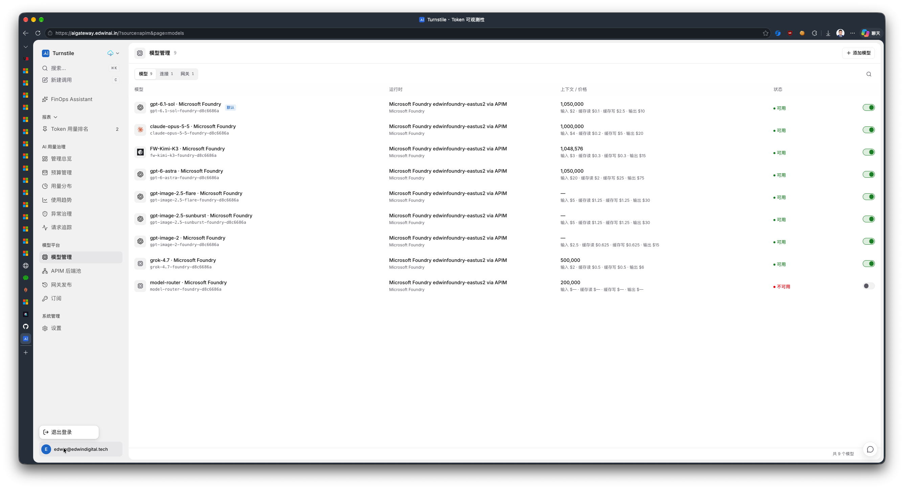
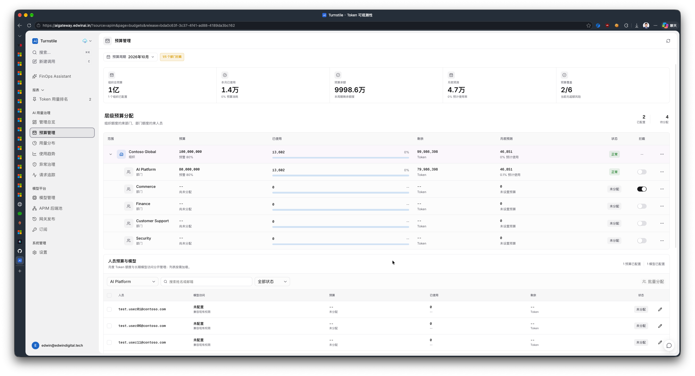

# 用户设置功能需求分析

| 项目 | 内容 |
| --- | --- |
| 功能目录 | `plan/user-settings/` |
| 编写日期 | 2026-10-09 |
| 状态 | 已实现/上线，最新共享包 `9cc17fa` 已只读复验；独立上游PR #32 Open |
| 最新核对 | 2026-10-11 / 当前源码 `ee27527`；初始调查与候选记录为历史 |
| 初始开发基线 | `712a1c9` |
| 上游提交基线 | `4e93935`；已独立整理，排除助手功能提交 |
| 配套文档 | [设计文档](design.md) |

## 1. 目标与范围

在侧栏底部现有用户名称菜单中增加“用户设置”，提供当前登录用户的个人资料与账号信息页面。密码登录用户可修改头像、显示名称及密码；Microsoft 登录用户只能查看资料。账号信息对两类用户均只读。

本需求最初用于文档设计，现已完成实现、本地验证及当前 repo `main` 的发布。2026-10-09 已在用户授权环境应用 `011_user_settings_profile` 并发布 `540956d`，保留旧迁移与业务配置；独立上游 PR 仍待合并。实际部署范围及未验证项见[设计文档发布记录](design.md#103-实际发布与-pr-补充)。

| 需求编号 | 用户要求 | 本期范围 |
| --- | --- | --- |
| US-01 | 点击用户名称增加用户设置选项 | 在现有账号菜单中增加入口，保留退出登录 |
| US-02 | 进入用户信息设置页面 | 展示头像、显示名称、账号名称、登录方式及账号信息 |
| US-03 | 账号密码用户支持修改头像、密码和显示名称 | 自助上传/替换或移除本人头像、修改显示名称；验证当前密码后修改密码 |
| US-04 | Microsoft 用户只显示信息 | 页面无资料编辑入口，服务端拒绝资料和密码写入 |
| US-05 | 账号信息只读 | 展示权限组、组织/部门、预算使用情况、可用模型及使用统计 |
| US-06 | 布局和可视化参考图 2 | 复用现有 FinOps 工作区的紧凑标题、指标条、进度条、表格及状态样式 |

不包含：Microsoft 头像修改、账号名称/邮箱修改、账号绑定/解绑、注册与找回密码、其他用户管理、组织/部门编辑、权限组调整、预算分配、模型授权修改、Microsoft Graph 写入。

## 2. 参考图与解读

图 1 用于确认入口位置；图 2 用于确认模块布局、密度和可视化样式。图片中的账号、组织、模型、预算数字都是参考内容，不作为新功能的默认值或额外功能要求。

页面应保留图 2 的工作台语义：固定标题区、紧凑筛选工具条、横向指标条、清晰的模块标题、浅色表头、行分隔线、数字对齐和细进度条。不得复制其中的预算编辑按钮、批量分配、拦截开关或他人数据。

## 3. 现状与差距

以下为初始开发阶段的源码核查结果，不代表当前发布状态。

| 能力 | 已有实现 | 差距 |
| --- | --- | --- |
| 用户入口 | `frontend/src/app.tsx` 的 `sidebar-account` 下拉菜单 | 当前只有退出登录 |
| 登录资料 | `/api/v1/auth/me` 返回 `id/email/name/role/method/session_expires_at` | 无用户设置聚合接口和资料修改接口 |
| 登录方式 | 会话 `method` 为 `password` 或 `entra` | 页面和写接口需要按当前会话限制编辑 |
| 头像 | `AuthProvider.photo` 读取 Microsoft Graph；失败时显示首字母；应用管理另有头像上传能力 | 新增个人本地头像存储及本人读写接口，参考应用头像处理方式；Microsoft 头像仍只读 |
| 账号存储 | PostgreSQL `app_user` 保存显示名称、密码哈希、平台角色 | 目前密码更新通过 `backend.accounts` 命令完成 |
| 组织目录 | `enterprise_catalog()` 与已观测 APIM 用户、启用的 Owner 账号合并 | 无组织/部门目录表；登录账号不一定存在于人员目录 |
| 权限组 | 平台角色只有 `owner/member` | 未持久化 Entra 安全组/App Roles，不能宣称已支持读取这些组 |
| 预算 | `token_budget`、部门拦截模式及预算证据/用量查询 | 现有预算管理响应覆盖多个范围，需增加本人限定投影 |
| 模型访问 | 人员模型策略、注册表及动态模型分配规则 | 不能简单把全部启用模型当作本人可用模型 |
| 使用统计 | APIM overview/trends/distribution 仓储查询支持用户过滤 | 现有 HTTP 接口的过滤条件不是本人访问边界，需服务端固定身份 |

### 3.1 数据源边界

- **登录账号**：`app_user.id` 为 UUID，`email` 为账号名称；密码和显示名称是账号数据。个人本地头像按账号 UUID 独立持久化，不写入人员用量或模型治理数据。
- **组织归属**：来自现有企业目录合并结果，不从邮箱域名推断，也不因存在预算记录就创建目录实体。
- **预算与用量**：来自数据库治理、预算证据及 APIM 遥测，不从前端示例或图 2 数字生成。
- **人员治理标识**：预算、模型策略及 APIM 遥测主要使用邮箱形式的人员 ID，不能直接使用 `app_user.id` 查询。
- **Microsoft 登录**：当前保存验证后的邮箱与名称，但没有保存组织部门或 Entra 权限组；`User.Read` 头像权限不等于这些信息已经可用。

## 4. 用户与权限矩阵

“密码登录用户”和“Microsoft 登录用户”按当前服务端会话的 `method` 判定，不按邮箱域名或前端推断。Owner 与 Member 均能进入自己的用户设置；Owner 在此页面也不能编辑治理信息。

| 操作/字段 | 密码登录 | Microsoft 登录 | 未登录 |
| --- | --- | --- | --- |
| 打开用户设置 | 允许 | 允许 | 进入登录流程 |
| 查看头像/名称/账号名称 | 允许 | 允许 | 不允许 |
| 修改显示名称 | 允许 | 不允许 | 不允许 |
| 修改密码 | 验证当前密码后允许 | 不允许 | 不允许 |
| 上传/替换/移除本地头像 | 允许 | 不允许 | 不允许 |
| 修改账号名称 | 不允许 | 不允许 | 不允许 |
| 查看本人权限组和组织/部门 | 只读 | 只读 | 不允许 |
| 查看本人预算、模型、统计 | 只读 | 只读 | 不允许 |
| 在本页修改角色、归属、预算、模型 | 不允许 | 不允许 | 不允许 |

同一邮箱可能同时具备密码和 Microsoft 登录能力。Microsoft 会话即使对应账号已有密码，也必须只读；密码会话允许修改。密码会话只使用本地头像，Microsoft 会话只使用 Graph 头像；切换登录方式不覆盖本地头像，也不能把上一会话的头像残留到当前会话。当前 Microsoft 再次登录可能同步覆盖 `display_name`，本期沿用现有行为，不额外引入双名称存储或修改账号绑定规则。

## 5. 功能需求

### 5.1 US-01：账号菜单

- 用户名称/头像整行继续作为下拉菜单触发器。
- “用户设置”排在“退出登录”之前，使用 `UserRound` 图标；保留现有退出逻辑。
- 点击后关闭菜单并进入 `?page=user-settings`，使用现有 query-string 导航和浏览器历史。
- 用户设置为平台级页面，从 APIM 或 GitHub Copilot 工作区均可进入；保留原 `source` 参数，不把个人设置强行归属某一数据源。
- 不把本入口合并到现有“系统管理 > 设置”；二者职责不同。
- 支持键盘打开、选择、关闭和返回焦点；移动端选中后收起侧栏。

### 5.2 US-02/US-03/US-04：个人资料

| 字段 | 展示与交互规则 |
| --- | --- |
| 用户头像 | 密码会话显示已保存本地头像，可上传/替换或移除；Microsoft 会话仅显示 Graph 头像且只读；无对应头像时取显示名称或账号名称首字符 |
| 显示名称 | 密码会话可编辑，初始值来自 `name`；Microsoft 会话使用只读文本 |
| 账号名称 | 显示 `email`，完整值可读取和复制；不可编辑，不新增用户名体系 |
| 登录方式 | 明确显示“账号密码”或“Microsoft 账号” |
| 账号信息 | 独立只读区域，包含第 5.4 节全部模块 |

显示名称修改规则：

- 去除首尾空白，允许中文及其他合法 Unicode 文本；有效名称最多 160 个字符，拒绝控制字符。
- 允许清空，持久化为 `NULL`；身份摘要及侧栏回退显示账号名称，表单不把邮箱当作实际名称保存。
- 内容未变时不能重复保存；提交中禁用重复操作。
- 保存成功后更新页面、侧栏和认证上下文；刷新后仍保持。
- 保存失败保留输入并显示就近错误；取消恢复已保存值。
- 显示名称仅用于展示，不改变账号 ID、邮箱、目录归属、预算归属或模型策略。

头像修改规则：

- 仅密码会话在资料头像处提供“更换头像”图标入口；已有本地头像时提供“移除头像”，不要求用户再次输入密码。
- 支持 PNG、JPEG、WebP，不接受 SVG/GIF、任意远程图片 URL 或其他文件；本期为静态头像，不保留动画。
- 文件选择后先展示方形裁切预览，默认居中裁切；用户确认后单独保存头像，取消不写入。头像操作与显示名称表单独立。
- 原始文件大小最多 10 MiB；浏览器裁切/缩放后上传图像不超过 192x192 像素、64 KiB，大小以二进制内容而非 base64 文本长度计算。
- 服务端独立校验编码、实际格式、文件大小、尺寸与可解码性，并重新编码去除 EXIF 等元数据；不得仅信任扩展名或浏览器校验。
- 上传/替换成功后资料区与侧栏头像同步，刷新、退出再以密码登录或从另一设备登录后仍可读取；移除后回退首字母头像。
- 处理/提交中禁止重复操作；失败保留旧头像并提供就近重试，不能把尚未保存的预览显示为已保存结果。
- 不因修改头像撤销登录会话或延长会话有效期；头像不影响账号标识、权限、预算、目录归属或模型访问。
- 个人头像读取仅限本人有效密码会话，无公开地址、他人账号参数或共享缓存；预览与头像字节不得进入日志、统计事件或持久化前端存储。

Microsoft 资料展示规则：

- 不渲染头像更换/移除、名称编辑、保存、取消或修改密码按钮，不用一组禁用输入框伪装编辑功能。
- 登录方式旁可标注简短事实状态“Microsoft 管理”，不添加教程或大段功能说明。
- 头像读取失败不阻塞资料页面，不反复强制 Microsoft 授权。
- 绕过前端直接调用写接口，服务端仍须拒绝。

### 5.3 US-03：修改密码

- 仅密码会话出现“修改密码”命令，打开独立对话框。
- 输入当前密码、新密码、确认新密码；密码默认隐藏，支持有明确无障碍名称的显示/隐藏图标。
- 当前密码必须正确；新密码为 12-256 个字符，与现有账号创建长度下限和登录接口上限保持兼容。
- 不增加强制大小写/数字/符号组合规则；不对密码做 trim 或隐式规范化。
- 新密码不得与当前密码相同，确认密码必须匹配；前后端均校验。
- 当前密码错误不更新密码、不撤销会话，也不能被错误地当作登录过期。
- 成功后撤销该账号的全部 Turnstile 会话，包含当前会话，清除当前 cookie 与前端缓存，返回登录页面重新登录；不撤销 Microsoft 自身会话。
- 同一账号并发修改或登录时，不能留下用旧密码新签发的有效 Turnstile 会话。
- 错误尝试需限流，密码及其哈希不得进入日志、审计、分析事件、URL、持久化前端存储或查询缓存。

### 5.4 US-05：只读账号信息

| 模块 | 必须展示 | 业务口径与缺省状态 |
| --- | --- | --- |
| 当前权限组 | 平台权限组名称及 `owner/member` 标识 | 本期权限组指平台角色，不冒充 Entra 组；不提供角色修改 |
| 所属组织/部门 | 组织名称、部门名称，可辅以标识 | 按当前目录合并规则解析；没有匹配则“未关联”，保留真实来源 |
| 预算使用情况 | 月度预算、已使用、剩余、月底预测、使用率、预算状态和部门执行模式 | Token 预算，不是金额；只查询本人；未分配不等于 0 或无限 |
| 可用模型列表 | 名称、模型标识、提供方、上下文窗口、授权来源和运行状态 | 区分模型授权与健康状态，不提供编辑/启用开关 |
| 使用统计 | 请求数、总 Token、输入/输出/缓存读取/缓存写入、错误率、费用估算、时间趋势及按模型汇总 | 仅当前人员的 APIM 数据；数据缺失、未计价、无使用记录分开表达 |

组织/部门规则：

- 复用现有人员目录，按登录邮箱匹配人员 ID，并沿 `user -> department -> organization` 解析。
- 默认 Owner 归属属于平台配置来源，不应描述为 Microsoft 组织目录中的真实部门。
- Member 登录账号尚无可匹配目录记录时显示“未关联”，不得默认填为 AI Platform。
- 人员归属是当前目录结果，不据此过滤本人历史使用记录；人员调部门后仍可查看本人历史用量。

预算规则：

- 默认选择当前 UTC 自然月，可查看最近 12 个月；预算月份不因显示时区变化而移动。
- 只显示本人额度，不显示组织/部门总额度、其他人员行或预算审计列表。
- 未分配仍可展示已有本人用量；余额及百分比为空，显示“未分配”/`--`。
- 剩余额度允许为负数；进度条限制为 0%-100%，文本保留真实超额比例。
- 预算状态沿用正常/预警/已超额/未分配；执行模式单独显示“仅告警”或“超额拦截”，不做成开关。
- 预算使用和实际遥测统计可能因入账月份、证据补偿及延迟不同而不相等，不能用图表总 Token 强行覆盖预算已使用。

模型规则：

- 明确人员策略存在且授权列表为空表示禁止全部；不能回退为全部模型。
- 未配置策略时，仅遵循已有兼容规则；要求显式分配的动态模型不在兼容可用列表。
- 过滤角色、模型/连接/运行时/网关启用状态、有效路由和功能开关等条件，与现有调用路径一致。
- 已授权但健康检查异常的模型保留“暂不可用”状态，避免把运行故障描述成权限撤销。
- 模型授权为当前长期策略，不随历史预算月份变化；预算耗尽可显示为账号预算风险，不隐藏模型授权记录。

统计规则：

- 默认与所选预算月使用相同 UTC 时间窗 `[月初, 下月月初)`；趋势桶和时间标签使用现有用户显示时区。
- 数据源明确标为 APIM，不将 GitHub Copilot 用户映射、Premium Request 预算或组织报表直接混入。
- 总 Token = 输入 + 缓存读取 + 缓存写入 + 输出，缓存分类不可重复累计。
- 费用使用已有遥测价格快照/回算口径，标明为 USD 估算，不使用当前模型报价重算所有历史数据。
- 请求数、错误率和模型汇总需按完整时间窗聚合，不能由截断的请求列表在浏览器推算。
- 无请求时显示请求数和 Token 为 0，错误率/平均时延显示 `--`；不能用接口失败或身份不匹配伪装为 0。

## 6. 状态、质量与安全要求

- 个人资料先展示，预算、模型和统计按模块加载；某模块失败不遮蔽其他模块，不锁死头像或名称修改。
- 提供固定尺寸的加载状态、局部重试、明确空状态；切换月份不显示上一月份数据为本月结果。
- 姓名、邮箱、长模型名称和大数字在 375px 移动端、768px 平板、1440px/1920px 桌面均不重叠。
- 复用现有主题、语言、时间格式、数字格式、Lucide 图标及 UI 组件。
- 只读信息使用文本、标签和表格，而非可编辑控件；状态同时有文字和颜色。
- 服务端从认证会话确定目标用户，不接受客户端指定 `user_id/email/role/method`。
- 接口不返回密码哈希、会话 token、提供方凭据、订阅密钥、他人数据或完整组织目录。
- 身份查询、个人统计和凭据操作均不缓存于共享 HTTP 缓存；切换账号/退出/过期清除查询缓存。
- 新增账号变更审计记录操作者、动作、时间和结果，不保存密码相关内容、头像图像/base64、原始文件名或 EXIF 元数据。
- 新功能不得改变现有预算治理、Microsoft 登录授权范围或模型调用规则；本次仅新增资料自助更新和只读投影。

## 7. 验收标准

| 编号 | 场景 | 通过条件 |
| --- | --- | --- |
| AC-01 | 点击侧栏用户名称 | 显示用户设置及退出登录，前者进入独立页面 |
| AC-02 | 直接访问及浏览器返回 | 登录后 `page=user-settings` 可刷新恢复；APIM/Copilot 来源均不被规范化到首页 |
| AC-03 | 个人资料展示 | 展示真实头像或回退头像、显示名称、邮箱、当前登录方式 |
| AC-04 | 密码登录修改名称 | 保存及刷新生效，侧栏同步；清空后回退邮箱；账号标识不变 |
| AC-05 | 名称校验及失败 | 超长/控制字符被拒绝；失败保留输入；未变更不能重复提交 |
| AC-06 | 密码修改失败 | 错误当前密码、不匹配、过短/超长或相同新密码均不更新账号 |
| AC-07 | 密码修改成功 | 全部旧 Turnstile 会话失效；旧密码不能登录，新密码能登录 |
| AC-08 | 并发及限流 | 同账号并发改密/登录不会产生旧凭据有效会话；超限返回 429 |
| AC-09 | Microsoft 只读 | 无头像/名称/密码编辑入口；手工调用写接口返回 403，即使账号已存在密码和本地头像 |
| AC-10 | 只读账号信息 | 权限、归属、预算、模型和统计完整，没有治理修改控件 |
| AC-11 | 数据隔离 | 两个用户交叉访问/篡改参数不能读取或更新他人信息；Owner 自助页同样限定本人 |
| AC-12 | 缺少归属/预算 | 显示未关联/未分配，不编造部门，不将未知数据呈现为 0 |
| AC-13 | 模型策略边界 | 无策略兼容、显式空策略、显式授权、动态分配、停用/健康异常均准确 |
| AC-14 | 统计口径 | 仅本人 APIM 数据；跨月/时区、缓存拆分、未计价和入账延迟处理一致 |
| AC-15 | 局部失败/过期 | 局部可重试；会话过期回登录；错误当前密码不会清除正常会话 |
| AC-16 | 视觉与无障碍 | 按图 2 的模块密度验收；浅/深主题、移动端、键盘及长文本无溢出 |
| AC-17 | 密码登录修改头像 | PNG/JPEG/WebP 经预览确认后保存，侧栏同步，刷新及再次登录/另一设备读取仍生效 |
| AC-18 | 头像取消/失败/移除 | 取消或失败保留旧头像；移除后刷新仍为首字母；头像操作不提交未保存名称 |
| AC-19 | 头像文件安全 | 超限、伪格式、不可解码、超尺寸和动画上传被服务端拒绝；保存内容无 EXIF；失败不覆盖旧头像 |
| AC-20 | 头像身份与缓存隔离 | 他人、未登录及 Microsoft 会话不能读取/更新本地头像；切换账号/登录方式不残留旧头像 |

## 8. 设计决策与后续议题

按补充需求，密码登录用户支持修改头像，Microsoft 头像继续只读。本草案选择“权限组 = Turnstile 平台角色”“账号名称 = 登录邮箱”“本地与 Microsoft 头像按当前登录方式隔离”“APIM 月度个人统计”；文件限制、裁切和移除行为为本期设计决策。

未来如需要真实 Entra 安全组/部门、可管理组织目录、Microsoft 与本地独立显示名称、个人 GitHub Copilot 统计，应另立需求，明确数据权威来源、身份映射、授权范围和隐私边界。不得在本功能中通过新增 Graph 权限或默认填值悄然扩展范围。
